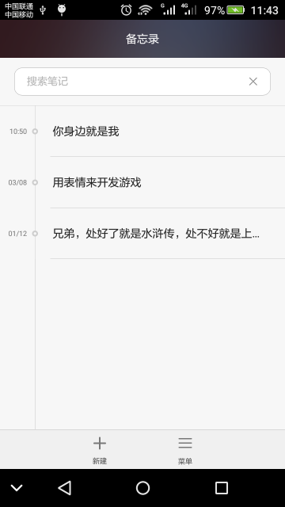
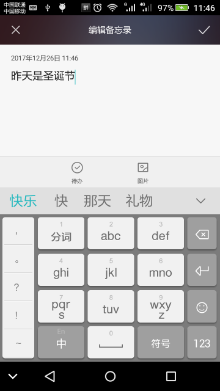
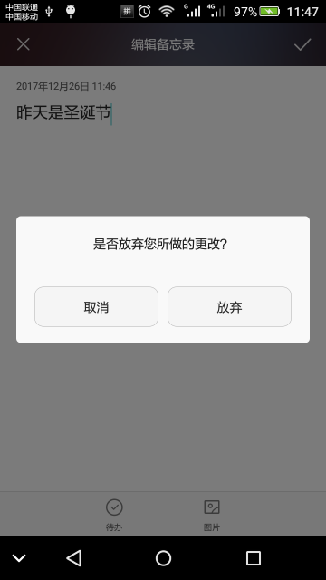
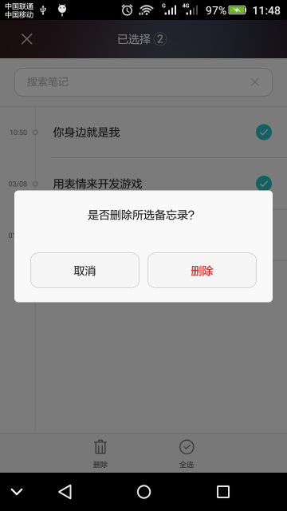
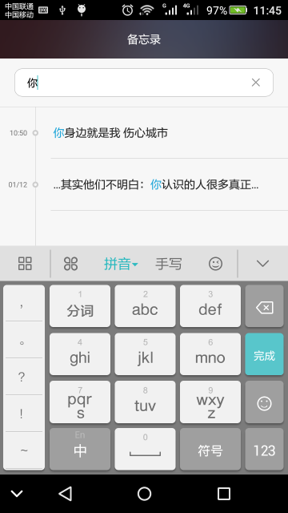
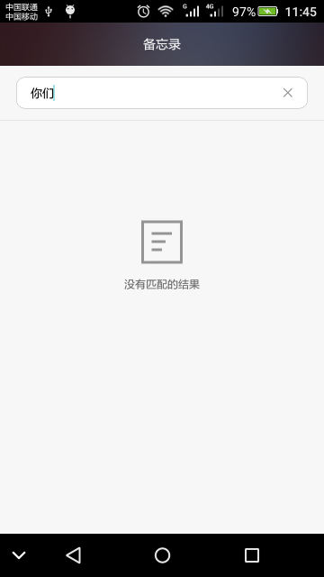
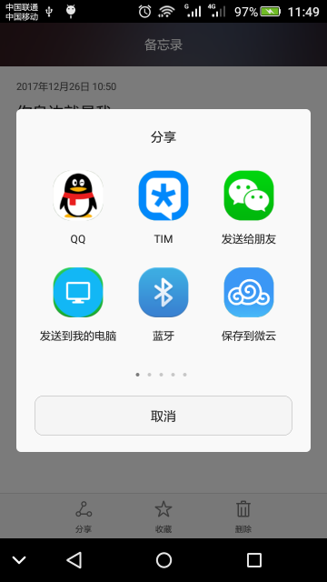

# BLOG

[TOC]

## 功能

### 列表


### 创建（编辑）



### 删除


### 查询



### 分享


## 接口标准

### list
```
POST http://url/api
Content-type: application/x-www-form-urlencoded
POST_BODY:
reqmethod=list

返回结果
{
  "errcode": 0,
  "errmsg": "ok",
  "data": [
    {
      "id": 648,
      "title": "中文EnglishВладимир Владимирович",
      "description": "文EnglishВлимир Владимиро",
      "content": "文EnglishВладимир Владимир",
      "pubTime": 1514263026461,
      "readTimes": 9665
    },
    {
      "id": 347,
      "title": "中文EnglishВладимир Владимирович",
      "description": "文EnglishВлимир Владимиро",
      "content": "文EnglishВладимир Владимир",
      "pubTime": 1514263029701,
      "readTimes": 10691
    }
  ]
}
```

### get
```
POST http://url/api
Content-type: application/x-www-form-urlencoded
POST_BODY:
reqmethod=get

返回结果
{
  "errcode": 0,
  "errmsg": "ok",
  "data": {
    "id": 1,
    "title": "中文EnglishВладимир Владимирович",
    "description": "文EnglishВладимир Владимиров",
    "content": "中文EnglishВладимир Вла",
    "pubTime": 1514262656594,
    "readTimes": 222
  }
}
```

### add
```
POST http://url/api
Content-type: application/x-www-form-urlencoded
POST_BODY:
reqmethod=add

返回结果
{"errcode":0,"errmsg":"created","data":111}
```

### update
```
POST http://url/api
Content-type: application/x-www-form-urlencoded
POST_BODY:
reqmethod=update

返回结果
{"errcode":0,"errmsg":"updated"}
```

### delete
```
POST http://url/api
Content-type: application/x-www-form-urlencoded
POST_BODY:
reqmethod=delete

返回结果
{"errcode":0,"errmsg":"deleted"}
```


### longtime
```
POST http://url/api
Content-type: application/x-www-form-urlencoded
POST_BODY:
reqmethod=longtime

返回结果
Error connecting: timed out
```
